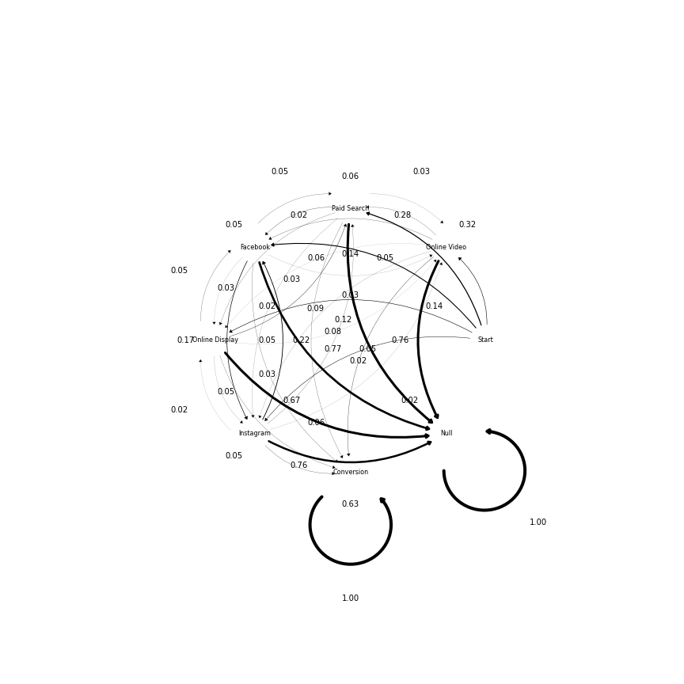

# Data-driven Attribution with Markov Chains

## Project Description
The purpose of this mini-project is to show develop a simple data-driven attribution model with Markov Chains
 
## Projects Status
WIP

### Tech Stack 
* Python
* Jupyter Lab
* PyCharm
* GitHub

## Getting Started

1. `git clone https://github.com/Iskriyana/attribution-markov-chains.git`
2. `conda create -n attribution-markov-chains python=3.9.1`
3. `conda activate attribution-markov-chains`
4. `pip install -r requirements.txt`

---

